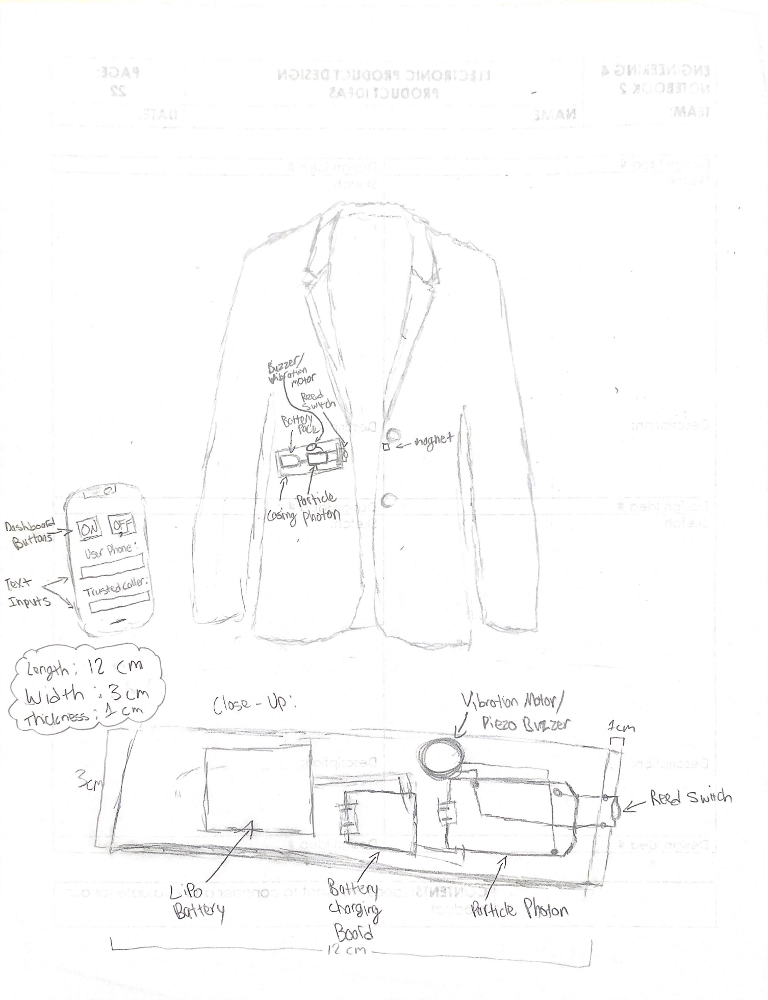
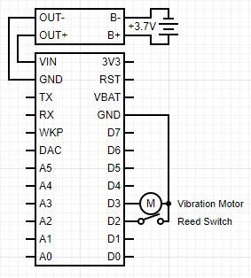

# Engineering-4-Product-Design-Class-2019-2020
During my senior year of high school, I took a class called Engineering 4/Product Design, where we were tasked to design and develop our own IOT projects. This is the Node Red and Particle.io code for my project, as well as the circuit diagram and other paperwork.

This is the pitch for the project that I came up with when developing the design of the product: 

If you are walking on the streets alone at night and end up in a dangerous situation (i.e. a stalker following you, a thief trying to rob you, an attempted kidnap, etc.), you can button the top button of your button-up to activate the "Head's Up" Button-Up. Doing so will connect the magnet to the reed switch, which are sewn into opposite sides of your button-up shirt near where the top button is.

When the magnet is connected to the reed switch, it triggers Twilio to text your friends and family and alerts them to your location using the Google Geocoding node. The text or call will also tell them to text the Twilio number if they are on their way, which will cause the vibration motor in the device to vibrate against your chest, letting you know that help is coming. This provides a discreet way of calling for help without alerting your attacker/stalker.

You can use buttons on the Dashboard to activate or deactivate the device when you want to button your clothing normally. There are also text inputs on the dashboard to set what numbers the device will text. All of the electronics will be stored inside of a thin compact case (about the size of a wallet) with the reed switch exposed at one end, so that the process of sewing into or onto an article of clothing is easier.

The complete development time for this project was about 2-3 weeks during the COVID-19 Crisis.

